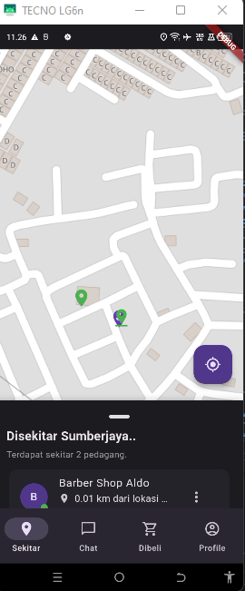

# Aplikasi Melacak Pedagang Berbasis Android (Proyek Penulisan Ilmiah)

Aplikasi Android yang dibangun menggunakan Flutter untuk memudahkan pengguna menemukan pedagang di sekitar mereka secara realtime. Proyek ini merupakan implementasi dari Penulisan Ilmiah di jurusan Informatika, Universitas Gunadarma.

## 🎯 Latar Belakang Masalah (Problem)
- Kesulitan masyarakat dalam mencari informasi pedagang terdekat secara efisien.
- Belum adanya aplikasi khusus yang fokus pada pelacakan lokasi pedagang (baik tetap maupun keliling) secara *realtime*.
- Kebutuhan untuk mendukung pertumbuhan bisnis lokal dengan meningkatkan visibilitas mereka.

## ✨ Fitur Utama (Features)
- **Peta Interaktif:** Menampilkan lokasi pedagang di sekitar pengguna.
- **Multi-user Role:** Sistem mendukung 4 jenis pengguna: Anonim, Pembeli, Penjual Keliling, dan Penjual Tetap, masing-masing dengan hak akses yang berbeda.
- **Fitur Chat Realtime:** Komunikasi langsung antara pembeli dan penjual.
- **Sistem Pemesanan:** Alur pemesanan lengkap, mulai dari memesan hingga melacak status pesanan.
- **Profil Pengguna:** Manajemen profil untuk pembeli dan penjual.

## 📸 Screenshot Aplikasi
(WAJIB! Masukkan screenshot terbaik dari slide Anda ke bagian ini)

| Halaman Sekitar | Profil Pembeli | Profil Penjual Keliling |
| :---: | :---: | :---: |
|  | `[Masukkan Screenshot Profil Pembeli]` | `[Masukkan Screenshot Profil Penjual]` |

## 🛠️ Teknologi yang Digunakan
- **Frontend (Mobile):** Flutter
- **Backend & Database:** Pocketbase (Backend-in-a-box)
- **Fitur Realtime:** Javascript (via Pocketbase Realtime API / WebSockets)
- **Manajemen State:** Flutter Bloc
- **Routing:** Go Router
- **Layanan Lokasi:** Geolocator, Geocoding

## 🏛️ Arsitektur & Desain Sistem
Proyek ini dikembangkan menggunakan metodologi **SDLC Waterfall** dan didokumentasikan dengan:
- *Use Case Diagram*
- *Activity Diagram*
- *Class Diagram*
- *Struktur Navigasi*

*(Opsional tapi sangat direkomendasikan: Upload file PDF slide PI Anda ke repository dan berikan link-nya di sini)*
> Untuk detail perancangan sistem yang lebih lengkap, silakan lihat [presentasi Penulisan Ilmiah](link-ke-file-pdf-anda.pdf) di repository ini.

## ⚙️ Cara Menjalankan Proyek
1.  Pastikan sudah menginstal [Flutter SDK](https://flutter.dev/docs/get-started/install).
2.  Clone repository ini: `git clone [link-repo-anda]`
3.  Jalankan `flutter pub get` untuk menginstal dependensi.
4.  Jalankan aplikasi: `flutter run`
