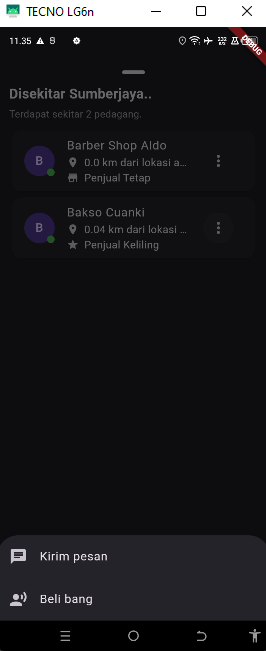
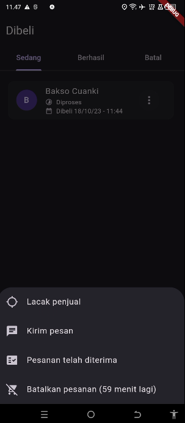

# Aplikasi Melacak Pedagang Berbasis Android (Proyek Penulisan Ilmiah)

Aplikasi Android yang dibangun menggunakan Flutter untuk memudahkan pengguna menemukan pedagang di sekitar mereka secara realtime. Proyek ini merupakan implementasi dari Penulisan Ilmiah di jurusan Informatika, Universitas Gunadarma.

## 🎬 Video Demo Aplikasi

  <video width="320" alt="Demo Video Aplikasi" controls>
    <source src="[screenshot/Cuplikandemo.mp4]" type="video/mp4">
    Browser Anda tidak mendukung tag video.
  </video>

  ➡️ Tonton video demo lengkap (resolusi tinggi) di  
  <a href="https://drive.google.com/file/d/17LeKYFnTKdQD5M6rF19bbGdNzs-6vqhn/view?usp=sharing" target="_blank">
    Google Drive
  </a>.

## 🎯 Latar Belakang Masalah (Problem)
- Kesulitan masyarakat dalam mencari informasi pedagang terdekat secara efisien.
- Belum adanya aplikasi khusus yang fokus pada pelacakan lokasi pedagang (baik tetap maupun keliling) secara *realtime*.
- Kebutuhan untuk mendukung pertumbuhan bisnis lokal dengan meningkatkan visibilitas mereka.

## ✨ Fitur Utama (Features)
- **Peta Interaktif:** Menampilkan lokasi pedagang di sekitar pengguna.
- **Multi-user Role:** Sistem mendukung 4 jenis pengguna: Anonim, Pembeli, Penjual Keliling, dan Penjual Tetap, masing-masing dengan hak akses yang berbeda.
- **Fitur Chat Realtime:** Komunikasi langsung antara pembeli dan penjual.
- **Sistem Pemesanan:** Alur pemesanan lengkap, mulai dari memesan hingga melacak status pesanan.
- **Profil Pengguna:** Manajemen profil untuk pembeli dan penjual.

## 📸 Screenshot Aplikasi

| Halaman Sekitar | Pembeli Ingin Membeli | Halaman Dibeli |
| :---: | :---: | :---: |
|  |  |  |

## 🛠️ Teknologi yang Digunakan
- **Frontend (Mobile):** Flutter
- **Backend & Database:** Pocketbase (Backend-in-a-box)
- **Fitur Realtime:** Javascript (via Pocketbase Realtime API / WebSockets)
- **Manajemen State:** Flutter Bloc
- **Routing:** Go Router
- **Layanan Lokasi:** Geolocator, Geocoding

## 🏛️ Arsitektur & Desain Sistem
Proyek ini dikembangkan menggunakan metodologi **SDLC Waterfall** dan didokumentasikan dengan:
- *Use Case Diagram*
- *Activity Diagram*
- *Class Diagram*
- *Struktur Navigasi*

> ### **Untuk detail perancangan sistem yang lebih lengkap, silakan lihat [Presentasi Penulisan Ilmiah di Google Slides](https://docs.google.com/presentation/d/17wgye39yV8EXxExWCbp369bASWhGbyj7/edit?usp=sharing).**

## ⚙️ Cara Menjalankan Proyek
1.  Pastikan sudah menginstal [Flutter SDK](https://flutter.dev/docs/get-started/install).
2.  Clone repository ini.
3.  Jalankan `flutter pub get` untuk menginstal dependensi.
4.  Jalankan aplikasi: `flutter run`
